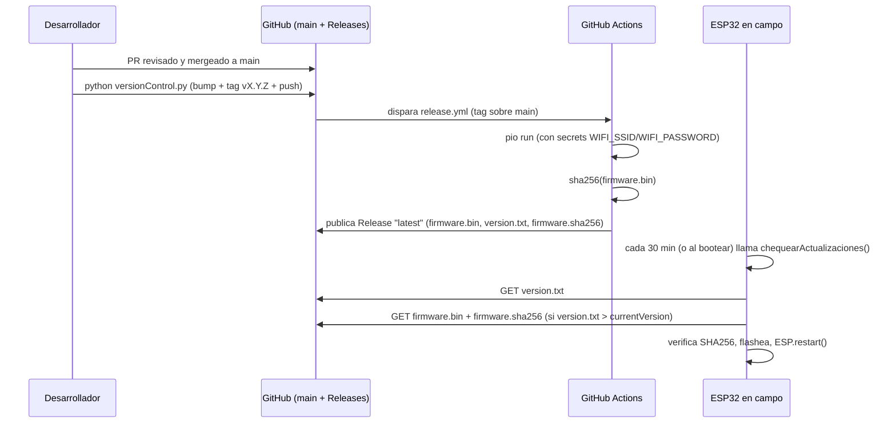

# LoraSenderAysafi

Firmware ESP32 (TTGO/Heltec LoRa32, variante **Sender**) para control de acceso vehicular/peatonal en el condominio Monjitas: lee tags RFID/NFC por un lector serie, activa relés de portón/puerta, retransmite comandos por LoRa a un receptor remoto, publica telemetría por MQTT y se autoactualiza (OTA) vía GitHub Releases.

> Manual de configuración de equipos y administración de la lista blanca: ver [`user manual.md`](user%20manual.md).

## Tabla de contenido

- [Arquitectura](#arquitectura)
- [Estructura del repositorio](#estructura-del-repositorio)
- [Requisitos y compilación local](#requisitos-y-compilación-local)
- [Configuración de hardware (`board_def.h`)](#configuración-de-hardware-board_defh)
- [Sistema de publicación de firmware (OTA vía GitHub)](#sistema-de-publicación-de-firmware-ota-vía-github)
- [Variables/secretos requeridos](#variablessecretos-requeridos)
- [Mensajería MQTT](#mensajería-mqtt)
- [Limitaciones conocidas](#limitaciones-conocidas)
- [Roadmap: hacia un sistema de control de acceso propio de AYSAFI](#roadmap-hacia-un-sistema-de-control-de-acceso-propio-de-aysafi)

## Arquitectura

```mermaid
flowchart LR
    RFID[Lector RFID/NFC\n(UART)] -->|tag id| ESP[ESP32 Sender]
    ESP -->|activa| PORTON[Relé Portón]
    ESP -->|activa| PUERTA[Relé Puerta peatonal]
    ESP <-->|LoRa 915MHz| RECV[ESP32 Receiver remoto]
    ESP <-->|MQTT| BROKER[emqx.aysafi.com]
    ESP -->|WiFi HTTPS| GH[GitHub Releases\n(OTA)]
    SD[(SD card\ntags.txt)] --> ESP
```

- **Lista blanca de tags**: se carga desde `/tags.txt` en la SD al arrancar (`loadTagsFromFile`). No hay alta/edición de tags desde el propio firmware; se administra editando ese archivo (ver manual de usuario).
- **Botones físicos** (`IN1`/`IN2`/`IN3` en la variante `LORA_V2_0_OLED`): accionamiento directo de portón, puerta peatonal y parada de emergencia.
- **LoRa**: retransmite comandos hacia/desde un receptor remoto con verificación CRC32.
- **MQTT**: publica logs, estado y tags leídos; permite accionar remotamente (`.../accionamientos`) y reiniciar (`.../reset`).
- **Reinicio periódico**: el equipo se reinicia solo cada 30 min (`loop()`), lo cual además sirve como disparador natural para revisar actualizaciones OTA.

## Estructura del repositorio

```
src/
  main.cpp        # setup()/loop(), lectura de tags, LoRa, MQTT
  board_def.h      # Selección de placa, pines, credenciales (via build_flags), OTA
  images.h         # Bitmaps para el OLED
lib/               # Forks vendorizados de LoRa y SSD1306 (no tocar salvo bugfix puntual)
test/              # (placeholder, sin pruebas automatizadas todavía)
.github/workflows/release.yml   # Pipeline de build + publicación de firmware
versionControl.py               # Helper de release (bump versión + tag + push)
```

## Requisitos y compilación local

- [PlatformIO](https://platformio.org/) (CLI o extensión de VS Code).
- Variables de entorno con las credenciales WiFi (no están en el repo):

```powershell
$env:WIFI_SSID = "AYSAFI"
$env:WIFI_PASSWORD = "********"
pio run -e ttgo-lora32-v2       # compilar
pio run -e ttgo-lora32-v2 -t upload   # flashear por USB
```

Si `WIFI_SSID`/`WIFI_PASSWORD` no están definidas, la compilación falla explícitamente (`#error` en `board_def.h`) en vez de compilar con credenciales vacías o de ejemplo.

## Configuración de hardware (`board_def.h`)

Selecciona la variante de placa activando **un solo** flag:

| Flag | Placa |
|---|---|
| `LORA_V1_0_OLED` | TTGO LoRa V1.0 |
| `LORA_V1_2_OLED` | TTGO LoRa V1.2 + DS3231 |
| `LORA_V1_6_OLED` | TTGO LoRa V1.6 + SD |
| `LORA_V2_0_OLED` | TTGO LoRa V2.0 + SD + relés (variante en uso) |

`LORA_SENDER` (0 = receptor, 1 = emisor) es sobreescribible por `build_flags` (`-D LORA_SENDER=0`), aunque hoy el `platformio.ini` solo define el entorno *sender*.

`LORA_PERIOD` fija la banda regional de LoRa (`433`/`868`/`915` MHz) — debe coincidir con la del receptor.

## Sistema de publicación de firmware (OTA vía GitHub)

Flujo end-to-end, desde que hay un cambio de código hasta que llega al equipo en campo:



Puntos clave:

- **"Aprobado" = tag manual del mantenedor.** El workflow [`release.yml`](.github/workflows/release.yml) solo corre con tags `vX.Y.Z`, y además verifica que el tag sea ancestro de `main` (rechaza tags creados desde ramas no mergeadas).
- **Publicación estable**: los assets se sirven desde `releases/latest/download/...`, una URL que GitHub mantiene apuntando siempre al último release — el firmware no necesita saber el número de versión de antemano.
- **Verificación de integridad**: el dispositivo descarga `firmware.sha256` y calcula el SHA-256 del binario mientras lo escribe en flash; si no coincide, aborta sin reiniciar.
- **Comparación de versión semántica** (`MAJOR.MINOR.PATCH` numérico), no comparación de strings.
- Publicar un release nuevo: `python versionControl.py --part patch|minor|major` desde `main`, limpio y actualizado.

## Variables/secretos requeridos

| Nombre | Dónde se define | Uso |
|---|---|---|
| `WIFI_SSID` | Env var local / GitHub Actions secret | Red WiFi del condominio |
| `WIFI_PASSWORD` | Env var local / GitHub Actions secret | Contraseña de esa red |
| `FW_VERSION_OVERRIDE` | Solo lo define CI (`release.yml`) | Version embebida = tag publicado |

**Nunca** se deben commitear valores reales de estas variables (revisar `git diff` antes de un `git add -A`).

## Mensajería MQTT

Broker: `emqx.aysafi.com:1883` (sin TLS ni autenticación actualmente — ver Roadmap).

| Tópico | Dirección | Propósito |
|---|---|---|
| `/aysafi/mqtt/loraSender/Monjitas1/reset` | suscribe | `payload == "1"` → `esp_restart()` |
| `/aysafi/mqtt/loraSender/Monjitas1/accionamientos` | suscribe | `"vehicular"` / `"peatonal"` → activa relé |
| `aysafi/mqtt/loraSender/Monjitas1/Tags` | publica | tag leído + apartamento + fecha |
| `aysafi/esp32Lora/Monjitas/Sender` | publica | heartbeat (`act-<segundos>s`) cada ciclo de loop |
| `aysafi/mqtt/Monjitas/Sender` | publica | aviso de reinicio |
| `/aysafi/monjitas1/sender/logs` | publica | `logMessage()` (también escribe a `log.txt` en SD) |

## Limitaciones conocidas

- Sin gestión remota de la lista blanca: agregar/quitar un tag exige sacar la SD y editar `tags.txt` a mano.
- MQTT sin usuario/contraseña ni TLS: cualquiera con acceso a la red/broker puede leer logs o **accionar el portón**.
- OTA: el binario se descarga por HTTP plano sobre `HTTPClient` sin fijar una CA explícita (se apoya en la validación por defecto del core de Arduino-ESP32); no hay firma criptográfica del firmware, solo verificación de integridad (SHA-256), no de autenticidad.
- `test/` no contiene pruebas automatizadas todavía.
- No hay registro/auditoría persistente de accionamientos más allá del log de texto en la SD.

## Roadmap: hacia un sistema de control de acceso propio de AYSAFI

Ideas ordenadas de mayor a menor prioridad para evolucionar esto de "firmware puntual para Monjitas" a un **producto de control de acceso reutilizable** para cualquier condominio:

1. **Multi-tenant por configuración, no por compilación.** Hoy `idSlave`, tópicos MQTT y URLs dependen de constantes fijadas en tiempo de compilación (`"Monjitas1"`). Mover a un archivo de configuración en SD/NVS (`condominio.json`: nombre de sitio, tópicos MQTT, IDs de nodos) para que **un mismo binario** sirva a todos los condominios.
2. **Portal de administración embebido** (como ya existe en el proyecto hermano `nodeIO_master`): un AP + página web local para:
   - Alta/baja/edición de tags sin desmontar la SD.
   - Configuración de WiFi/MQTT/LoRa desde el propio equipo (hoy es todo hardcodeado).
3. **Backend centralizado (multi-condominio)**: servicio (Aysafi Cloud) que:
   - Sincroniza la lista blanca hacia todos los nodos de un condominio (altas/bajas se propagan solas, no hay que tocar SD en cada equipo).
   - Centraliza logs de accionamiento y eventos (auditoría real, hoy solo texto plano local).
   - Expone una app/dashboard para administradores del condominio (residentes, visitas, horarios permitidos).
4. **Seguridad de la mensajería**: MQTT con TLS + usuario/contraseña por dispositivo (o certificados por nodo), y ACLs en el broker para que un nodo no pueda publicar/suscribirse a tópicos de otro condominio.
5. **Firma de firmware**: además del checksum SHA-256 ya implementado, firmar los releases (ed25519/RSA) y verificar la firma en el equipo antes de flashear — así un compromiso del repo/CI no basta para inyectar firmware malicioso en campo.
6. **Métodos de identificación adicionales**: además de RFID/NFC, soportar códigos QR temporales para visitas, PIN por app móvil, o placas vehiculares vía cámara — reutilizando el mismo bus de "accionamiento" que ya usan LoRa/MQTT.
7. **Registro de eventos con evidencia**: asociar cada accionamiento a una foto/snapshot (si se agrega cámara) y subirla al backend, útil para incidentes de seguridad en el condominio.
8. **Modo failover sin nube**: si se cae WiFi/Internet, la lista blanca local en SD/NVS debe seguir funcionando (ya es así), pero además encolar localmente los eventos para sincronizarlos cuando vuelva la conectividad.
9. **Gestión de flota**: dashboard que muestre, por condominio, qué nodos están en qué versión de firmware, permitiendo publicar releases progresivos (canary) antes de un rollout completo, en vez de "todos actualizan igual apenas hay `latest`".
10. **Pruebas automatizadas** (`test/`): al menos pruebas unitarias del parser de `tags.txt`, la comparación semver y la verificación de checksum, para no regresar bugs de seguridad al tocar el OTA.
